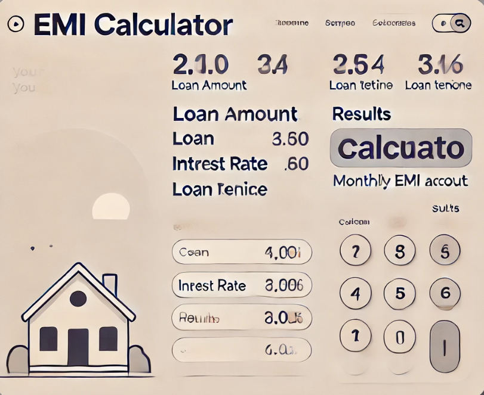

# EMI Calculator

## Overview

This project is an EMI (Equated Monthly Installment) Calculator designed to help users compute their monthly loan payments based on various parameters. The application provides a user-friendly interface for inputting loan details and generates accurate EMI calculations. It is built using Django for the backend and features a clean and responsive frontend.

## Features

- **EMI Calculation**: Calculate monthly installments based on loan amount, interest rate, and tenure.
- **Loan Amortization Schedule**: View a detailed breakdown of each EMI payment, including principal and interest components.
- **User Input Validation**: Ensure that all input fields are correctly filled before performing calculations.
- **Responsive Design**: Accessible and functional on both desktop and mobile devices.

## Tech Stack

- **Frontend**: HTML, CSS, JavaScript (with Bootstrap for styling)
- **Backend**: Django
- **Database**: SQLite (or any other database supported by Django)
- **Authentication**: Django's built-in authentication system (optional, if user accounts are needed)
- **Styling**: Bootstrap

## Installation

### Prerequisites

Make sure you have the following installed:

- [Python](https://www.python.org/)
- [Django](https://www.djangoproject.com/)
- [Git](https://git-scm.com/)

- ## Usage

- **Users**: Enter loan details including loan amount, interest rate, and tenure to calculate the EMI. View the amortization schedule and get insights into monthly payments.

- ## Authors

- [YourUsername](https://github.com/YourUsername)
